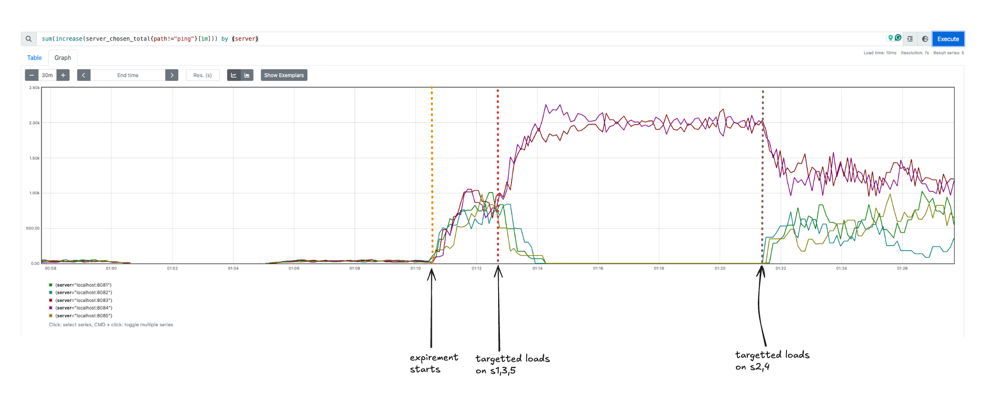

# Go Prequel

## Overview

This is an implementation of Google's prequel load balancing algorithm being used to serve traffic in Youtube's servers
(ref paper -  [Load is not what you should balance: Introducing Prequal](https://arxiv.org/abs/2312.10172))

## Key Features

- **Server Mode**:
    - Maintains current RIF (Requests in Flight) and Latency as specified in the paper.
    - Latency estimation is currently powered by a simple max heap to calculate medians.
    - Serves 3 kind of requests - `/Ping`, `/Medium` and `/Batch` as examples of fast, medium and long latency handlers.
- **Client Mode**:
    - Asynchronously probes a set of replicas to figure out their current RIF and Latency.
    - For load balancing the said `/Ping`, `/Medium` and `/Batch` requests, it utilized HCL (Hot Cold Lexicographic)
      Rule as specified in the paper.
    - Maintains probe health and management on each probe.
    - Naive Round Robin selection is also implemented for comparison.
- **Metrics Collection**:
    - Exposes relevant metrics for load monitoring on server and client.

## Sample Result

The following is the result of a sample run of a single client serving requests to a pool of 5 servers which were
later-on bombareded with non prequel-lb clients.
Let's observe the behavior of the prequel-lb client in the following graph:



- At **T0** : The prequel-lb starts serving traffic to all the servers. (~**20RPS** per server)
- At **T1** : 2 round robin clients start serving traffic to servers 1,4,5. (~**66RPS** per server), hence rendering
  those servers hot and the observed lb reduces the traffic to those servers.
- At **T2** : The round robin clients start serving traffic to servers 2,3. (~**50RPS** per server), hence all the
  servers become relatively cold and the traffic is again being served to 1,4,5.

## Prerequisites

- Go 1.18 or later
- `go mod` for dependency management

## Installation

1. Clone the repository:
    ```sh
    git clone https://github.com/yourusername/go-prequel.git
    cd go-prequel
    ```

2. Install dependencies:
    ```sh
    go mod tidy
    ```

## Configuration

The client configuration is specified in a JSON file. An example configuration file `config.json` is provided:

```json
{
  "max_probe_pool_size": 16,
  "num_replicas": 5,
  "probe_rate": 1.0,
  "q_rif_threshold": 0.75,
  "delta_reuse": 0.1,
  "max_probe_age": 5000000000,
  "max_probe_use": 1,
  "servers": [
    "localhost:8081",
    "localhost:8082",
    "localhost:8083",
    "localhost:8084",
    "localhost:8085"
  ]
}
```

## Sample Run

### Running the Server

To start the server, use the following command:

```sh
make start-servers
```

### Running the Client

To start the client, use the following command:

```sh
make start-clients
```

### Command Line Flags

- `-mode`: Mode to run (`server` or `client`).
- `-port`: Port to run the server on (server mode only).
- `-config`: Path to the config file (client mode only).
- `-selection`: Server selection mode (`hcl` or `round_robin`).
- `-metrics-port`: Port to run the metrics server for client.

## Metrics

Metrics are collected and served on the specified metrics port. You can access the metrics at
`http://localhost:<metrics-port>/metrics`.

## License

This project is licensed under the MIT License. See the `LICENSE` file for details.

## Contributing

Contributions are welcome! Possible ideas to contribute:

- Writing your own load balancing algorithm for the clients.
- Writing a more efficient latency estimation algorithm for the servers.
- Writing a different RIF normalization technique for the client RIF distribution.
- Keeping q_rif dynamic (not suggested by the paper, just for fun :D )

## Contact

For any questions or issues, please open an issue on GitHub or reach out to me
at [singhuddeshyaofficial@gmail.com](mailto:singhuddeshyaofficial@gmail.com) or
ping me on twitter [@uds5501](https://x.com/uds5501)